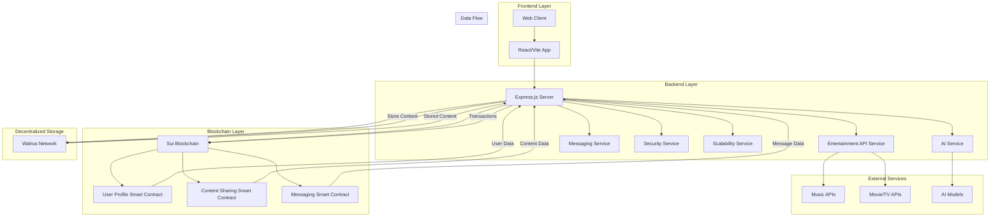

# Plix Platform Architecture

## Overview

This diagram shows the high-level architecture of the Plix platform, illustrating how different components interact with each other.

## Component Descriptions

### Frontend Layer
- **Web Client**: User interface accessed through web browsers
- **React/Vite App**: Modern, responsive user interface built with React and Vite

### Backend Layer
- **Express.js Server**: RESTful API server handling client requests
- **Entertainment API Service**: Integration with music, movie, and TV show APIs
- **AI Service**: Artificial intelligence features for personalization and content generation
- **Messaging Service**: Private messaging functionality
- **Security Service**: Authentication, authorization, and data protection
- **Scalability Service**: Performance optimization and caching

### Blockchain Layer
- **Sui Blockchain**: Decentralized foundation for user data and transactions
- **User Profile Smart Contract**: Manages user profiles and preferences
- **Content Sharing Smart Contract**: Handles content sharing and interactions
- **Messaging Smart Contract**: Manages private messaging between users

### Decentralized Storage
- **Walrus Network**: Decentralized storage for user-generated content

### External Services
- **Music APIs**: Integration with music streaming services
- **Movie/TV APIs**: Integration with entertainment databases
- **AI Models**: External AI services for advanced features

## Data Flow

1. Users interact with the **Web Client**
2. The client communicates with the **Express.js Server** via RESTful APIs
3. The server processes requests and interacts with various services:
   - **Entertainment Service** for media content
   - **AI Service** for personalization
   - **Messaging Service** for private messages
   - **Security Service** for authentication and protection
   - **Scalability Service** for performance optimization
4. For blockchain operations:
   - User data is managed by **User Profile Smart Contract**
   - Content is managed by **Content Sharing Smart Contract**
   - Messages are handled by **Messaging Smart Contract**
5. Large content files are stored on **Walrus Network**
6. All data flows back to the client for user interaction

## Security Boundaries

- **Frontend**: Client-side validation and sanitization
- **Backend**: Server-side validation, authentication, and authorization
- **Blockchain**: Immutable records and decentralized trust
- **Storage**: Encrypted content storage with access controls

## Scalability Points

- **Load Balancing**: Multiple backend servers
- **Caching**: In-memory and distributed caching layers
- **Database Sharding**: Horizontal partitioning of data
- **CDN**: Content delivery network for static assets
- **Microservices**: Independent scaling of different services